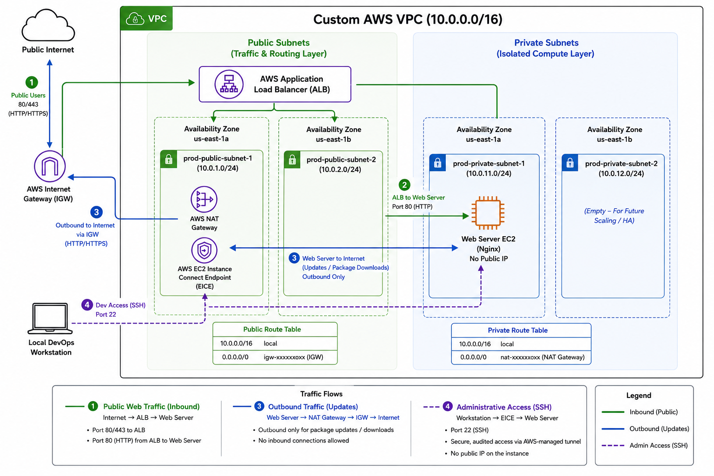

# ☁️ aws-devops-webops-lab


## 🧩 Project Summary

This is a hands-on DevOps portfolio project that shows how I evolved a simple Nginx website on AWS EC2 from a manual deployment into an automated and monitored infrastructure workflow.

The project demonstrates practical experience with Linux administration, Infrastructure as Code, configuration management, and observability using a single Ubuntu EC2 instance.

---

## 🎯 Why This Project Matters

This project reflects the kind of work involved in entry-level DevOps and cloud engineering roles:

- provisioning and managing infrastructure
- automating repeatable server configuration
- deploying application content reliably
- adding monitoring and operational visibility
- documenting the workflow clearly for reproducibility

---

## ⚙️ Skills Demonstrated

- AWS EC2
- Ubuntu Linux
- Nginx
- Terraform
- Ansible
- Prometheus
- Grafana
- Infrastructure as Code
- Configuration Management
- Monitoring and Observability
- SSH and Linux Administration

---

## 🔁 Project Evolution

This project progressed in stages:

1. Manual EC2 + Nginx deployment
2. Ansible-based server automation
3. Monitoring with Node Exporter, Prometheus, and Grafana
4. Terraform import for existing AWS infrastructure
5. Terraform-generated inventory for a smoother Terraform-to-Ansible workflow
6. Re-architecting for production: Zero-exposure manual multi-subnet topology (Current)

That progression is intentional and shows how I approach systems: start simple, automate repeated work, and then add operational visibility.

---

## 🏗️ Architecture Evolution

### Phases 1–5: Baseline Single-Instance Infrastructure
Initially, the project was deployed on a single public-facing Ubuntu EC2 instance running Nginx alongside a local Prometheus and Grafana monitoring stack. While functional for a sandbox, exposing all services on a public subnet introduced severe production security risks.

```text
Ubuntu EC2 (Public Subnet)
  ├── Nginx (Port 80)
  ├── Node Exporter (Port 9100)
  ├── Prometheus (Port 9090)
  └── Grafana (Port 3000)
  ```

Prometheus scrapes local host metrics, and Grafana visualizes service and system health.


---

### Phase 6: Production-Grade Zero-Exposure Network Topology (Current)
To eliminate public exposure, I manually re-architected the entire cloud network layout to enforce strict tier isolation. 



#### 🔄 Core Routing Dynamics:
1. **Inbound Traffic Plane:** Deployed public subnets across two distinct Availability Zones (`us-east-1a` and `us-east-1b`) to fulfill the infrastructure pre-requisites of an AWS Application Load Balancer (ALB). The ALB serves as the strict, single ingress point for internet traffic on port 80/443 and routes down to the hidden backend.
2. **Compute Isolation:** Moved the Nginx web server and monitoring instances entirely into a secure Private Subnet with zero public IP footprint. 
3. **Independent Outbound Path (Path 3):** Note on the diagram: The outbound package update route (Path 3) resolves from the private EC2 instance directly through the NAT Gateway in our public subnet, completely bypassing the inbound EICE management tunnel!
4. **Zero-Exposure Management Plane:** Public SSH (Port 22) is completely closed to the internet. Administrative traffic from my local machine tunnels securely through an AWS EC2 Instance Connect Endpoint (EICE) inside the public subnet.

## 🛠️ What I Built

- Manual Nginx hosting on AWS EC2
- Ansible playbooks for Nginx deployment and monitoring setup
- Terraform configuration imported from existing AWS infrastructure and used to generate Ansible inventory
- Monitoring stack with Node Exporter, Prometheus, and Grafana
- Documentation and proof artifacts for each stage of the project

---

## 📁 Repository Structure

```text
aws-devops-webops-lab/
├── ansible-project/   # playbooks, roles, sample inventory, screenshots
├── docs/              # phase-by-phase documentation
├── monitoring/        # monitoring config and notes
├── terraform/         # Terraform configuration and generated inventory workflow
├── screenshots/       # manual deployment proof
└── README.md
```

---

## 🚀 Project Flow

Project progression:

```text
Manual setup
  -> Ansible automation
  -> Monitoring
  -> Terraform import for existing infrastructure
  -> Manual Multi-Tier Re-Architecture (Phase 6)
```

Current execution flow:

```text
Terraform
  -> generated Ansible inventory
  -> Ansible Nginx deployment
  -> Ansible monitoring deployment
  -> validation
```

- Terraform generates `ansible-project/inventory.generated.ini`
- Ansible deploys Nginx to the `web_servers` group
- Ansible deploys Prometheus and Grafana to the `monitoring` group
- Prometheus scrapes the local Node Exporter endpoint

Detailed phase docs:

- [Manual Nginx setup](docs/1-nginx-setup.md)
- [Ansible automation](docs/2-ansible-automation.md)
- [Monitoring setup](docs/3-monitoring-setup.md)
- [Terraform import setup](docs/4-terraform-setup.md)

---

## ▶️ Quick Run

### Manual inventory flow

```bash
cd ansible-project
cp inventory.example.ini inventory.ini
# edit inventory.ini with your Ubuntu host IP and key path
ansible-playbook -i inventory.ini playbook.yml
ansible-playbook -i inventory.ini monitoring.yml
```

### Terraform-generated inventory flow

```bash
ansible-playbook -i ansible-project/inventory.generated.ini ansible-project/playbook.yml
ansible-playbook -i ansible-project/inventory.generated.ini ansible-project/monitoring.yml
```

`inventory.example.ini` is the safe template for manual use.

`inventory.generated.ini` is machine-generated by Terraform and ignored by git.

---

## 📸 Proof Artifacts

| Area | Proof |
|------|-------|
| Manual EC2 setup | [EC2 running](screenshots/ec2-running.png), [SSH connection](screenshots/ssh-connection.png), [Nginx status](screenshots/nginx-status.png), [custom webpage](screenshots/Custom-webpage.png) |
| Ansible automation | [Playbook run](ansible-project/screenshots/Playbook_run.png) |
| Monitoring | [Grafana dashboard](monitoring/grafana/screenshots/grafana-dashboard-overview.png), [Prometheus targets](monitoring/grafana/screenshots/prometheus-targets-up.png) |

### Manual validation

The initial EC2 + Nginx setup was confirmed with a live custom page:


### Automation validation

The Ansible run shows the deployment moving from manual setup to repeatable automation:

This screenshot is from the earlier two-instance phase of the project, so it shows two host IPs even though the current setup has been simplified to one Ubuntu instance.


### Monitoring validation

Prometheus and Grafana confirm the instance is not only running, but observable:

This targets view is also from the earlier two-instance phase, which is why it shows two targets. The current project now runs monitoring locally on a single Ubuntu host.


---

## ✅ Key Outcomes

- Built a complete Nginx hosting workflow on AWS EC2
- Converted manual server setup into repeatable Ansible automation
- Added monitoring for infrastructure visibility and validation
- Connected Terraform and Ansible with generated inventory for smoother automation
- Produced portfolio-ready documentation for both technical and non-technical readers

---

## 📌 Current State

- Nginx deployment automated with Ansible
- Monitoring stack running on the same host
- Network Tier: Multi-subnet VPC with Public/Private isolation, ALB ingress, NAT Gateway egress, and EICE management.
- Compute Tier: Single Ubuntu EC2 instance running in a private subnet (manual layout).
- Automation Status: Ansible roles validated for Nginx and local monitoring; current focus is translating this manual network architecture into modular Terraform blocks next week.
- Terraform-assisted Ansible inventory generation
- Docker and CI/CD planned as the next improvements

---

## 🧭 Next Improvements

- Dockerized app or monitoring workflow
- CI checks with GitHub Actions
- CD pipeline for automated deployments


