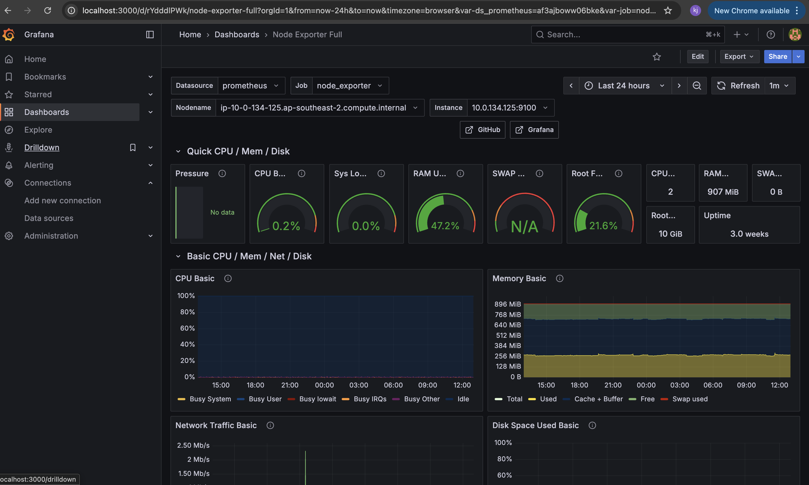
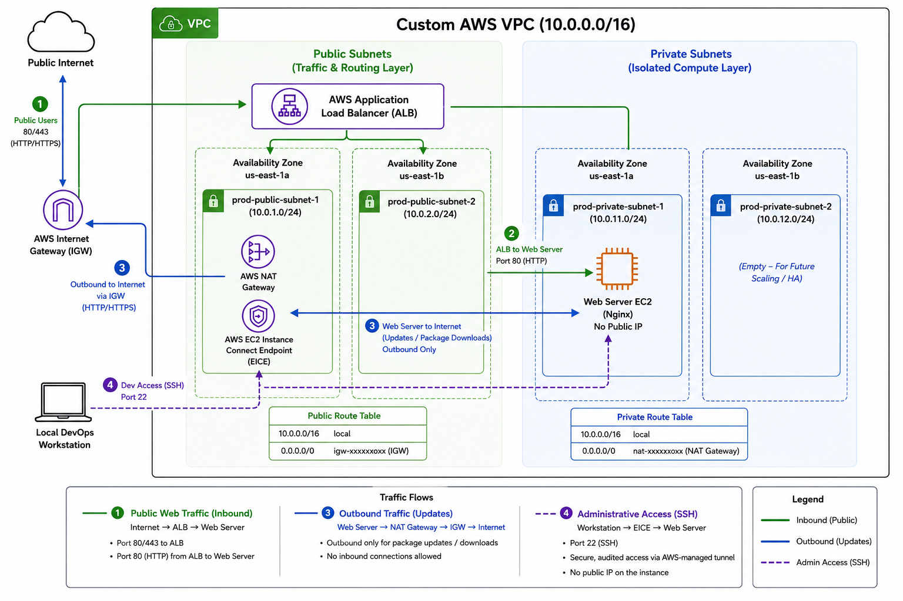
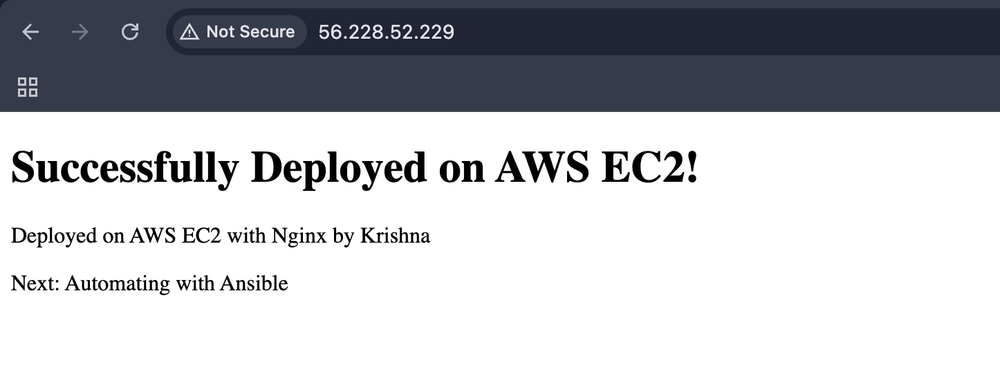
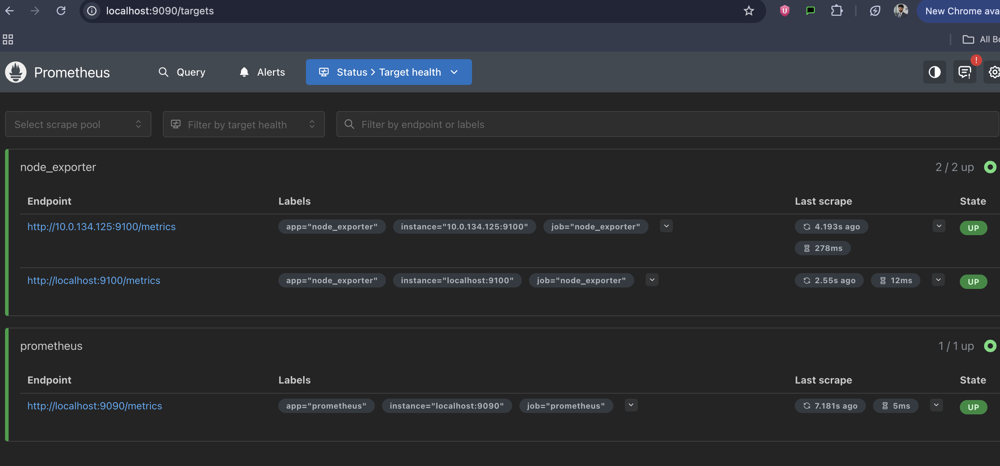

# ☁️ aws-devops-webops-lab


## 🧩 Project Summary

This is a hands-on DevOps portfolio project that shows how I evolved a simple Nginx website on AWS EC2 from a manual deployment into an automated, monitored, network-isolated, and fully-Terraform/Ansible-driven infrastructure workflow.

The project demonstrates practical experience with Linux administration, Infrastructure as Code, configuration management, observability, and secure network design on AWS.

---

## 🎯 Why This Project Matters

This project reflects the kind of work involved in entry-level DevOps and cloud engineering roles:

- provisioning and managing infrastructure
- automating repeatable server configuration
- deploying application content reliably
- adding monitoring and operational visibility
- designing and codifying a production-shaped network
- reaching a private, zero-public-IP instance through a proper bastion-less access pattern (EICE)
- managing Terraform state remotely and safely, with locking, instead of on a local disk
- documenting the workflow clearly for reproducibility

---

## ⚙️ Skills Demonstrated

- AWS EC2, VPC, ALB, NAT Gateway, EC2 Instance Connect Endpoint
- Ubuntu Linux
- Nginx
- Terraform (import workflow, modular design, and remote state with S3 + DynamoDB locking)
- Ansible (including dynamic, instance-ID-based inventory and EICE-tunneled SSH)
- Prometheus
- Grafana
- Docker (image builds, container lifecycle via Ansible `community.docker` modules, cloud-init bootstrapping via Terraform `user_data`)
- Infrastructure as Code
- Configuration Management
- Monitoring and Observability
- Network security design (tiered security groups, zero public exposure on compute)
- SSH and Linux Administration

---

## 🔁 Project Evolution

This project progressed in stages:

1. Manual EC2 + Nginx deployment
2. Ansible-based server automation
3. Monitoring with Node Exporter, Prometheus, and Grafana
4. Terraform import for existing AWS infrastructure, including generated Ansible inventory
5. Manual zero-exposure network re-architecture: multi-subnet VPC, ALB, and EC2 Instance Connect Endpoint
6. Terraform modular refactor — codifying that network design as reusable Terraform modules, wiring Ansible to reach the private-subnet instance through EICE, and moving Terraform state to a remote, locked S3 backend
7. Docker on cloud-init + containerised Nginx — Docker daemon installed automatically at first boot via Terraform `user_data`; Nginx containerised and deployed through Ansible to validate the bootstrap and prove the container deployment path before the monitoring stack follows (Current)

That progression is intentional and shows how I approach systems: start simple, automate repeated work, add operational visibility, then harden and codify the network once the basics are proven, close the loop so automation actually reaches the hardened environment — and finally make the tooling itself (Terraform state) safe to collaborate on.

---

## 🏗️ Architecture Evolution

### Phases 1–4: Baseline Single-Instance Infrastructure
Initially, the project was deployed on a single public-facing Ubuntu EC2 instance running Nginx alongside a local Prometheus and Grafana monitoring stack. While functional for a sandbox, exposing all services on a public subnet introduced severe production security risks.

```text
Ubuntu EC2 (Public Subnet)
  ├── Nginx (Port 80)
  ├── Node Exporter (Port 9100)
  ├── Prometheus (Port 9090)
  └── Grafana (Port 3000)
  ```

Prometheus scrapes local host metrics, and Grafana visualizes service and system health.



---

### Phase 5: Manual Zero-Exposure Network Re-Architecture
To eliminate public exposure, I manually re-architected the entire cloud network layout to enforce strict tier isolation before writing any of it as code.



#### 🔄 Core Routing Dynamics:
1. **Inbound Traffic Plane:** Deployed public subnets across two distinct Availability Zones to fulfill the infrastructure pre-requisites of an AWS Application Load Balancer (ALB). The ALB serves as the strict, single ingress point for internet traffic on port 80/443 and routes down to the hidden backend.
2. **Compute Isolation:** Moved the Nginx web server and monitoring instances entirely into a secure Private Subnet with zero public IP footprint.
3. **Independent Outbound Path:** The outbound package update route resolves from the private EC2 instance directly through the NAT Gateway in the public subnet, completely bypassing the inbound EICE management tunnel.
4. **Zero-Exposure Management Plane:** Public SSH (Port 22) is completely closed to the internet. Administrative traffic from my local machine tunnels securely through an AWS EC2 Instance Connect Endpoint (EICE) inside the public subnet.

Full write-up: [05 — Manual Network Re-Architecture](docs/5-manual-network-rearchitecture.md)

---

### Phase 6: Terraform Modular Refactor + EICE-Wired Ansible + Remote State
The network design proven manually in Phase 5 is now codified as reusable Terraform modules — `vpc`, `security_groups`, and `compute` — so the same zero-exposure topology can be destroyed and rebuilt from code instead of AWS Console clicks.

```text
terraform-modular/
├── modules/vpc              # custom VPC, public/private subnets, IGW, NAT gateway
├── modules/security_groups   # alb_sg -> app_sg <- eice_sg
├── modules/compute           # EC2 instance, ALB, target group, listener, EICE
└── providers.tf              # AWS provider + S3/DynamoDB remote state backend
```

Terraform outputs the instance's private IP and the ALB's DNS name — the instance itself has no public IP.

Since the instance has no reachable IP at all from the operator's machine, Ansible automation for this layout is wired differently than the earlier public-IP phases: Terraform generates an inventory keyed on **instance ID** rather than IP, and `ansible.cfg` opens an EC2 Instance Connect Endpoint tunnel automatically on every connection via a `ProxyCommand`. This closes the loop between the hardened network and configuration management — Ansible now reaches the private-subnet instance with no manual tunneling step.

This phase also moved `terraform-modular/`'s own state off the local disk into a remote, locked S3 + DynamoDB backend. The legacy `terraform/` folder is left on local state intentionally, as it's a simple, self-contained reference rather than active infrastructure.

Full write-up: [06 — Terraform Modular Refactor](docs/6-terraform-modular.md)

---

### Phase 7: Docker on Cloud-Init + Containerised Nginx (Current)

To cut deployment time and build toward CI/CD, Docker was introduced as the delivery mechanism for the app layer. The daemon is installed automatically at first boot via Terraform `user_data` (cloud-init) — no Ansible task or manual step is required. The same Nginx page from Phase 01 now runs as a Docker container built on the instance by Ansible's `docker_stack` role, validating that the cloud-init bootstrap is correct and that the container deployment path works end-to-end through the EICE tunnel and ALB.

The monitoring stack (Node Exporter, Prometheus, Grafana) remains apt-installed for now. The next step is a Docker Compose file that replaces those three separate systemd services with a single, portable stack.

Full write-up: [07 — Docker Containerisation](docs/7-docker-containerization.md)

---

## 🛠️ What I Built

- Manual Nginx hosting on AWS EC2
- Ansible playbooks for Nginx deployment and monitoring setup
- Terraform configuration imported from existing AWS infrastructure and used to generate Ansible inventory
- Monitoring stack with Node Exporter, Prometheus, and Grafana
- A manually-designed, then Terraform-codified, zero-exposure network: private compute, public ALB, EC2 Instance Connect Endpoint for access
- An instance-ID-based, EICE-tunneled Ansible inventory so automation reaches the private-subnet instance with no manual steps
- Docker daemon bootstrapped via Terraform cloud-init at first boot; Nginx containerised and deployed through Ansible as the first step toward a fully containerised, CI/CD-ready stack
- A remote, locked Terraform state backend (S3 + DynamoDB) for the current infrastructure
- Documentation and proof artifacts for each stage of the project

---

## 📁 Repository Structure

```text
aws-devops-webops-lab/
├── ansible-project/     # playbooks, roles, sample inventory, screenshots
├── docker/              # Dockerfile and assets for the containerised Nginx app layer
├── docs/                # phase-by-phase documentation
├── monitoring/          # monitoring config and notes
├── terraform/           # Terraform import workflow (Phase 4, public-IP layout, local state)
├── terraform-modular/   # Terraform modules for the private-subnet network (Phase 6, remote state)
├── screenshots/         # deployment and architecture proof
└── README.md
```

---

## 🚀 Project Flow

Project progression:

```text
Manual setup
  -> Ansible automation
  -> Monitoring
  -> Terraform import for existing infrastructure
  -> Manual zero-exposure network re-architecture (Phase 5)
  -> Terraform modular refactor + EICE-wired Ansible + remote state (Phase 6)
  -> Docker on cloud-init + containerised Nginx (Phase 7, Current)
```

### Legacy execution flow (public-IP layout, Phases 1–4)

```text
Terraform (terraform/, local state)
  -> generated Ansible inventory (public IP)
  -> Ansible Nginx deployment
  -> Ansible monitoring deployment
  -> validation
```

- Terraform generates `ansible-project/inventory.generated.ini`
- Ansible deploys Nginx to the `web_servers` group
- Ansible deploys Prometheus and Grafana to the `monitoring` group
- Prometheus scrapes the local Node Exporter endpoint

### Current execution flow (private-subnet layout, Phase 6)

```text
Terraform (terraform-modular/, S3 + DynamoDB remote state)
  -> generated Ansible inventory (instance ID, not IP)
  -> ansible.cfg ProxyCommand opens EICE tunnel automatically
  -> Ansible Nginx deployment
  -> Ansible monitoring deployment
  -> validation via ALB (web) and EICE (admin)
```

- Terraform state for this folder is stored in S3 and locked via DynamoDB, not kept locally
- Terraform generates `ansible-project/inventory.ini`, keyed on instance ID
- `ansible.cfg`'s `ProxyCommand` sends a temporary SSH key and opens the EICE tunnel per connection — no manual tunnel required
- Ansible deploys Nginx and the monitoring stack exactly as in the legacy flow, just reached through EICE instead of a direct IP
- Web traffic is validated through the ALB; the instance itself has no public IP

Detailed phase docs:

- [01 — Manual Nginx setup](docs/1-nginx-setup.md)
- [02 — Ansible automation](docs/2-ansible-automation.md)
- [03 — Monitoring setup](docs/3-monitoring-setup.md)
- [04 — Terraform import setup](docs/4-terraform-setup.md)
- [05 — Manual network re-architecture](docs/5-manual-network-rearchitecture.md)
- [06 — Terraform modular refactor](docs/6-terraform-modular.md)
- [07 — Docker Containerisation](docs/7-docker-containerization.md)
---

## ▶️ Quick Run

### Manual inventory flow (legacy, public IP)

```bash
cd ansible-project
cp inventory.example.ini inventory.ini
# edit inventory.ini with your Ubuntu host IP and key path
ansible-playbook -i inventory.ini playbook.yml
ansible-playbook -i inventory.ini monitoring.yml
```

### Terraform-generated inventory flow (legacy, public IP)

```bash
ansible-playbook -i ansible-project/inventory.generated.ini ansible-project/playbook.yml
ansible-playbook -i ansible-project/inventory.generated.ini ansible-project/monitoring.yml
```

`inventory.example.ini` is the safe template for manual use.

`inventory.generated.ini` is machine-generated by Terraform and ignored by git.

### Modular network flow (Phase 6, private subnet + EICE + remote state)

```bash
cd terraform-modular
terraform init    # connects to the S3 backend automatically via providers.tf
terraform plan
terraform apply
terraform output load_balancer_url

cd ../ansible-project
ansible-playbook -i inventory.ini playbook.yml
ansible-playbook -i inventory.ini monitoring.yml
```

Ansible reaches this layout automatically through the EC2 Instance Connect Endpoint, and Terraform state for this folder lives remotely in S3 with DynamoDB locking — see [06 — Terraform Modular Refactor](docs/6-terraform-modular.md) for how the instance-ID inventory, `ProxyCommand` tunnel, and remote state backend all fit together.

### Docker-based app deployment (Phase 7, private subnet + EICE)

```bash
cd ansible-project
ansible-playbook -i inventory.ini docker_deploy.yml
```

> Requires Docker daemon on the instance, installed automatically at boot by `terraform apply` via `install_docker.sh`. If the apt-installed Nginx service is already running, stop it first to avoid a port 80 conflict: `sudo systemctl stop nginx`.

---

## 📸 Proof Artifacts

| Area | Proof |
|------|-------|
| Manual EC2 setup | [EC2 running](screenshots/ec2-running.png), [SSH connection](screenshots/ssh-connection.png), [Nginx status](screenshots/nginx-status.png), [custom webpage](screenshots/Custom-webpage.png) |
| Ansible automation | [Playbook run](ansible-project/screenshots/Playbook_run.png) |
| Monitoring | [Grafana dashboard](monitoring/grafana/screenshots/grafana-dashboard-overview.png), [Prometheus targets](monitoring/grafana/screenshots/prometheus-targets-up.png) |
| Network re-architecture | [Architecture diagram](screenshots/phase6-architecture.png) |

### Manual validation

The initial EC2 + Nginx setup was confirmed with a live custom page:



### Automation validation

The Ansible run shows the deployment moving from manual setup to repeatable automation:

This screenshot is from the earlier two-instance phase of the project, so it shows two host IPs even though the current setup has been simplified to one Ubuntu instance.


### Monitoring validation

Prometheus and Grafana confirm the instance is not only running, but observable:

This targets view is also from the earlier two-instance phase, which is why it shows two targets. The current project now runs monitoring locally on a single Ubuntu host.



---

## ✅ Key Outcomes

- Built a complete Nginx hosting workflow on AWS EC2
- Converted manual server setup into repeatable Ansible automation
- Added monitoring for infrastructure visibility and validation
- Connected Terraform and Ansible with generated inventory for smoother automation
- Redesigned the network for zero public exposure on compute, then codified that design as reusable Terraform modules
- Closed the loop by wiring Ansible to reach the hardened, private-subnet instance through an EC2 Instance Connect Endpoint, using an instance-ID-based inventory
- Moved Terraform state for the current infrastructure into a remote, locked S3 + DynamoDB backend
- Produced portfolio-ready documentation for both technical and non-technical readers

---

## 📌 Current State

- Nginx deployment automated with Ansible on both the legacy public-IP layout and the current private-subnet layout
- Monitoring stack running on the same host
- Network tier: multi-subnet VPC with public/private isolation, ALB ingress, NAT Gateway egress, and EICE management — defined in `terraform-modular/`
- Compute tier: single Ubuntu EC2 instance running in a private subnet, provisioned by Terraform
- Automation status: Ansible roles validated for Nginx and monitoring on both layouts; the private-subnet layout is reached automatically via an instance-ID inventory and an EICE `ProxyCommand` tunnel — no manual steps required
- Terraform-assisted Ansible inventory generation exists for both the legacy public-IP layout and the current modular/private-subnet layout
- State management: `terraform-modular/` uses remote state in S3 with DynamoDB locking; `terraform/` (legacy Phase 4) intentionally remains on local state
- Docker daemon is installed automatically on the instance at first boot via cloud-init; Nginx is containerised and deployable via `docker_deploy.yml`
- Next: Docker Compose for the monitoring stack, then a CI/CD pipeline

---

## 🧭 Next Improvements

- Docker Compose for the monitoring stack — replace individually apt-installed Node Exporter, Prometheus, and Grafana with a single `docker-compose.yml`
- CI pipeline with GitHub Actions — `terraform fmt`/`validate`, `ansible-lint`, and `docker build` checks on every push
- CD pipeline for automated deployments once the full stack is containerised