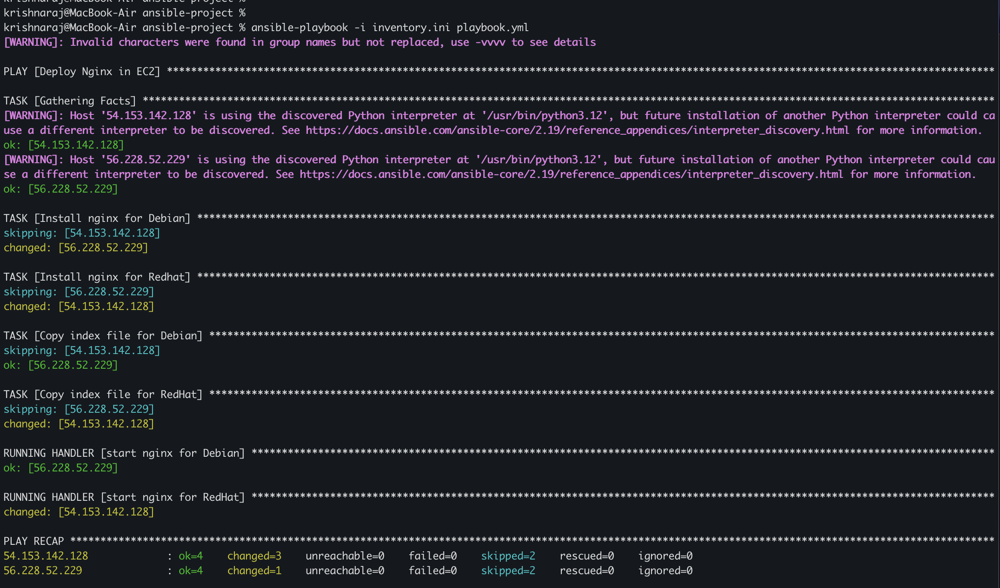

# 🔧 Ansible Automation — Nginx + Monitoring + Docker

This folder shows the automation phase of the project: turning a manually configured Ubuntu EC2 web server into a repeatable Ansible workflow.

---

## 🧩 What This Automates

- Installs and starts **Nginx** on Ubuntu (apt-based path, `playbook.yml`)
- Deploys a custom `index.html` page
- Installs **Node Exporter** for host metrics
- Deploys **Prometheus** and **Grafana** for monitoring
- Builds a custom **Docker image** and runs Nginx as a container (container-based path, `docker_deploy.yml`)
- Supports both manual and Terraform-generated inventory, including the private-subnet layout

---

## 🗂️ Key Files

| File | Purpose |
|------|---------|
| `playbook.yml` | Deploys Nginx (apt) to the `web_servers` group |
| `docker_deploy.yml` | Builds and runs containerised Nginx via the `docker_stack` role |
| `monitoring.yml` | Deploys Node Exporter, Prometheus, and Grafana |
| `inventory.example.ini` | Safe inventory template for manual runs |
| `inventory.generated.ini` / `inventory.ini` | Terraform-generated inventory, ignored by git |
| `roles/` | Ubuntu-focused Ansible roles |
| `roles/docker_stack/` | Copies `docker/nginx/` to the instance, builds `custom-nginx`, runs it as container `web-server` on port 80 |
| `ansible.cfg` | SSH config, including the EICE `ProxyCommand` used for the private-subnet layout |

---

## 🔁 How It Fits The Project

This phase comes after the manual EC2 setup.

```text
Manual EC2 setup
  -> Ansible automation
  -> Monitoring
  -> Terraform import + generated inventory
  -> Manual network re-architecture (private subnet, ALB, EICE)
  -> Terraform modular refactor + EICE-based Ansible wiring
  -> Docker daemon via cloud-init + containerised Nginx (proof of concept)
```

The goal is to show that the server can be rebuilt or updated consistently instead of configured by hand every time. The Docker path (`docker_deploy.yml`) exists to validate that the cloud-init Docker bootstrap works and to prove the container-based deployment pattern before the monitoring stack is moved to Docker Compose.

> **Current status:** the instance now runs in a private subnet behind an ALB, with no public IP (see [`terraform-modular/`](../terraform-modular/README.md)). Ansible reaches it through an EC2 Instance Connect Endpoint (EICE): the Terraform-generated inventory uses the **instance ID** as `ansible_host` (there is no IP to target), and `ansible.cfg`'s `ProxyCommand` opens an EICE tunnel keyed off that instance ID automatically on every connection. The older `inventory.example.ini` / public-IP workflow below still works unchanged for the legacy `terraform/` (Phase 4) layout.

---

## ⚙️ Run Commands

Manual inventory (legacy public-IP layout):

```bash
ansible-playbook -i inventory.ini playbook.yml
ansible-playbook -i inventory.ini monitoring.yml
```

Terraform-generated inventory (legacy public-IP layout, from `terraform/`):

```bash
ansible-playbook -i inventory.generated.ini playbook.yml
ansible-playbook -i inventory.generated.ini monitoring.yml
```

Terraform-generated inventory (current private-subnet layout, from `terraform-modular/`, via EICE):

```bash
ansible-playbook -i inventory.ini playbook.yml
ansible-playbook -i inventory.ini monitoring.yml
```

Docker-based Nginx deployment (any layout — requires Docker daemon on the instance, installed at boot by Terraform cloud-init):

```bash
ansible-playbook -i inventory.ini docker_deploy.yml
```

> **Port conflict:** `playbook.yml` and `docker_deploy.yml` both bind port 80. Run one or the other against the same host, not both. If switching from the apt path to the container path, stop the Nginx service on the instance first (`sudo systemctl stop nginx`).

`ansible.cfg`'s `ProxyCommand` handles sending the temporary SSH public key and opening the EICE tunnel per host for the private-subnet layout — no manual tunnel setup needed before running any playbook.

---

## 📸 Proof

The automation step was validated with a successful playbook run:

This proof image was captured during the earlier two-instance phase, so two host IPs appear in the output. The current repo has since been refactored to a single Ubuntu instance.



---

## 📖 Detailed Setup

- [Ansible setup doc](../docs/2-ansible-automation.md)
- [Monitoring setup doc](../docs/3-monitoring-setup.md)
- [Terraform modular refactor doc](../docs/6-terraform-modular.md)
- [Docker containerisation doc](../docs/7-docker-containerization.md)